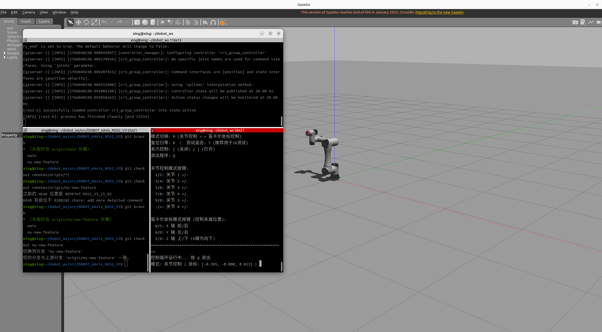

## main work 
參考xlerobot实现键盘控制dobot ros sdk gazebo仿真环境中的cr5机械臂
实现：
- 控制六个关节旋转（正解）
- 控制末端控制器在笛卡尔坐标系中的移动（逆解）


## manual
============================================================
DOBOT 机械臂键盘遥控程序 (精简版)
============================================================
模式切换: M (关节控制 <-> 笛卡尔坐标控制)
复位归零: R  |  测试姿态: T (推荐用于IK测试)
夹爪控制: [ (关闭) / ] (打开)
退出程序: Q

关节控制模式按键:
  1/2: 关节 1 +/-
  3/4: 关节 2 +/-
  5/6: 关节 3 +/-
  7/8: 关节 4 +/-
  9/0: 关节 5 +/-
  -/=: 关节 6 +/-

笛卡尔坐标模式按键 (控制末端位置):
  W/S: X 轴 前/后
  A/D: Y 轴 左/右
  Z/X: Z 轴 上/下 (X键为向下)
============================================================
控制循环运行中... 按 Q 退出


## quick start

启动仿真环境
```
cd ~/dobot_ws
ros2 launch dobot_gazebo gazebo_moveit.launch.py
```

在另一个终端中
```
cd ~/dobot_ws
python3 ./src/DOBOT_6Axis_ROS2_V3/example/dobot_teleop_refined.py
```



## reference 
https://github.com/Vector-Wangel/XLeRobot